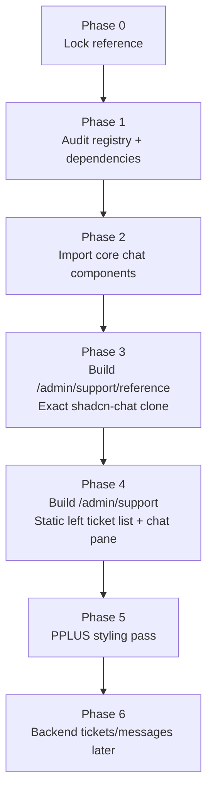
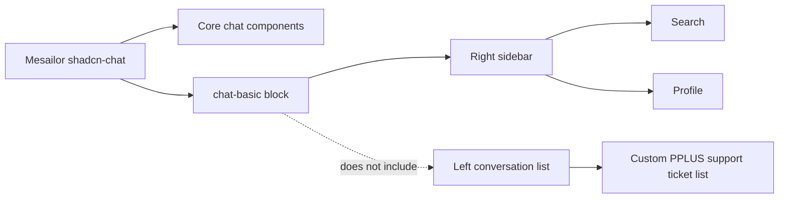
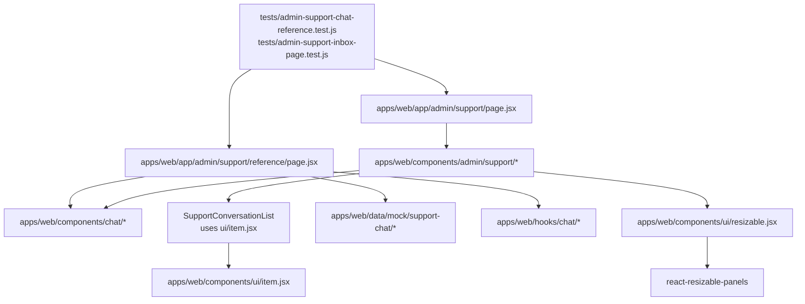

# Admin Support Chat Visual Plan

Linked implementation plan: [[2026-05-29-admin-support-shadcn-chat]]

## Target shape

```mermaid
flowchart LR
  AdminShell[Admin shell] --> SupportPage[/admin/support]
  SupportPage --> Resizable[ResizablePanelGroup\nleft/right adjustable split]
  Resizable --> TicketList[Left pane\nTicket / conversation list]
  Resizable --> ChatPane[Center pane\nshadcn-chat detail]
  ChatPane --> ChatHeader[Chat header\nCustomer + actions]
  ChatPane --> Messages[Message timeline\nBubbles, dates, reactions]
  ChatPane --> Composer[Composer\nText, emoji, attachments]
  ChatPane --> UtilitySidebar[Right utility panel\nSearch / Profile]

  Reference[/admin/support/reference] --> ExactClone[Exact shadcn-chat reference clone]
  ExactClone -. kept untouched .-> ChatPane
```

## Page layout sketch

```text
/admin/support
┌─────────────────────────────────────────────────────────────────────────────┐
│ Admin shell                                                                  │
│ ┌──────────────────────────┬──────────────────────────────────────────────┐ │
│ │ Support inbox             │ Chat detail                                  │ │
│ │ ┌──────────────────────┐  │ ┌────────────────────────────────────────┐  │ │
│ │ │ Search tickets        │  │ │ Sarah Miller   Athlete   Open   ⋯     │  │ │
│ │ └──────────────────────┘  │ └────────────────────────────────────────┘  │ │
│ │ Open  Pending  Resolved   │ ┌────────────────────────────────────────┐  │ │
│ │                          │ │ Today                                  │  │ │
│ │ ● Sarah Miller      2m   │ │ Sarah: I can't see my workout...       │  │ │
│ │   Calendar issue         │ │ Coach/Admin: Let me check that.        │  │ │
│ │   High · Athlete         │ │                                        │  │ │
│ │                          │ │ Yesterday                              │  │ │
│ │ ○ Mike Roberts     15m   │ │ ...                                    │  │ │
│ │   Login problem          │ └────────────────────────────────────────┘  │ │
│ │                          │ ┌────────────────────────────────────────┐  │ │
│ │ ○ Jenna Lee        1h    │ │ Type your message...              Send │  │ │
│ │   Billing question       │ └────────────────────────────────────────┘  │ │
│ └──────────────────────────┴──────────────────────────────────────────────┘ │
└─────────────────────────────────────────────────────────────────────────────┘
```

## Implementation phases



## Reference truth



## Guardrails

- First reproduce `shadcn-chat` exactly at `/admin/support/reference`.
- Do not style it into PPLUS before parity is proven.
- Do not wire DB or emails in the first UI pass.
- Keep the reference page untouched while adapting `/admin/support`.
- Build the left conversation/ticket list ourselves because the reference does not provide it.

## Left conversation list component

Use the existing local shadcn `Item` primitive for the left ticket/conversation rows:

```text
apps/web/components/ui/item.jsx
```

Row composition:

```text
ItemGroup        -> wraps ticket rows
Item             -> clickable conversation row
ItemMedia        -> avatar/status dot
ItemContent      -> customer, subject, preview
ItemTitle        -> customer/subject title
ItemDescription  -> latest message preview
ItemActions      -> timestamp/unread/action
ItemHeader       -> title + timestamp line
ItemFooter       -> priority/status/role metadata
```

Supporting primitives already present:

```text
Avatar, Badge, Button, Input, Item, ScrollArea, Separator, Tabs, DropdownMenu
```

Primitive to add:

```text
Resizable -> apps/web/components/ui/resizable.jsx
```

Expected dependency:

```text
react-resizable-panels
```

Use `ResizablePanelGroup` for the `/admin/support` left conversation list / chat detail split. Do not add it to `/admin/support/reference`.

Likely missing dependency if keeping the exact shadcn-chat emoji picker:

```text
emoji-picker-react
```

Do not add `Resizable` for v1 unless we decide the panes need to be user-resizable.

## File map


